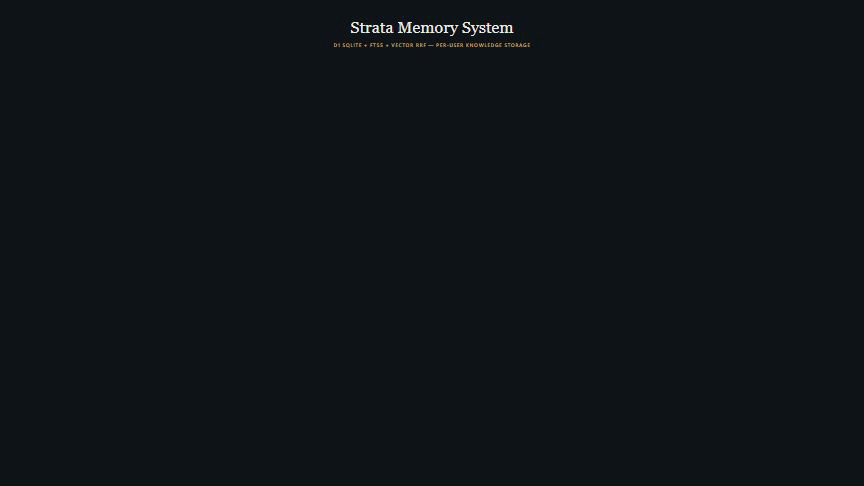

# strata-mcp

[](https://www.npmjs.com/package/strata-mcp)
[](LICENSE)
[](https://nodejs.org)
[](https://modelcontextprotocol.io)
[](https://github.com/kytheros/strata/actions)


**Persistent memory for AI agents.** Agents forget. Context windows roll over and the bug you fixed, the decision you made, and the pattern you found are gone. Strata captures these as structured knowledge while you work and gives them back to the next session — through the [Model Context Protocol](https://modelcontextprotocol.io), the open standard supported by Claude Code, Cursor, Cline, Continue, Claude Desktop, Codex CLI, and Gemini CLI.

**81.1% on LongMemEval-500** with the same BM25 + vector + RRF stack documented below — see [Benchmarks](docs/benchmarks.md). Runs locally on SQLite, on Cloudflare Workers + D1, or on Google Cloud Run.

**For AI coding assistants:** Strata auto-indexes your conversations from Claude Code, Codex CLI, Aider, Cline, and Gemini CLI into a shared knowledge base. Store a decision in Claude Code, recall it from Gemini CLI.

**For agents you build:** Deploy Strata as memory infrastructure via HTTP or multi-tenant transport. Ingest conversations from any source, search with BM25 + vector hybrid ranking, and give your agents the ability to learn from their own history. Deploy on [Cloudflare Workers + D1](#deploy-on-cloudflare-workers--d1) or [Google Cloud Run](#deploy-on-gcp-cloud-run).

**For game engines (NEW in v2):** Drop the REST transport into Unity, Godot, or Unreal for per-NPC memory. Two-tier auth (admin tokens issue player tokens), dialogue-shaped `/recall` endpoint that returns ready-to-prompt context, world/agent scoping. See [Game Engine REST API](https://strata.kytheros.dev/docs/game-engine-api).

**Semantic search included.** Add a free [Gemini API key](https://aistudio.google.com/apikey) to enable hybrid BM25 + vector search with 3072-dimensional embeddings, LLM-powered knowledge extraction, and training data accumulation for local model distillation. Falls back to keyword search without it.

**What makes Strata different:** Every knowledge entry passes through a [quality-gated evaluator pipeline](docs/evaluator-pipeline.md) before storage. Actionability, specificity, and relevance are checked deterministically. The result is a knowledge base that stays clean and auditable -- not a growing pile of everything.

No cloud required. No memory caps. Everything stays on your machine -- or deploy anywhere.

> **Status:** Beta. The data model and MCP tool surface are stable; CLI flags and deploy commands may shift between minor versions. Used in production by Kytheros LLC and design partners.
>
> **Who builds this:** Strata is built and maintained by **[Kytheros LLC](https://kytheros.dev)**. The community edition (this repo) is **Apache 2.0 licensed and free forever** — the feature set documented here is committed, not bait-and-switch. A commercial Pro tier adds the features listed under [Pro Edition](#pro-edition) below and funds ongoing development.
>
> **Support development:** [polar.sh/kytheros](https://polar.sh/kytheros) — sponsor or pick up a Pro license. Both directly fund the community edition.
>
> **Privacy:** Strata stores everything locally in `~/.strata/strata.db` by default and works fully offline with FTS5 keyword search. If you set `GEMINI_API_KEY`, queries and stored content are sent to Google's Gemini API for embeddings and extraction (subject to [Google's API terms](https://ai.google.dev/terms)). [Local LLM Inference](#local-llm-inference-gemma-4) removes the Gemini dependency entirely.

---

## Strata vs. other memory layers

|                              | **Strata**                          | Mem0                  | LangMem            | Raw vector DB |
|------------------------------|-------------------------------------|-----------------------|--------------------|---------------|
| **Integration model**        | MCP server (any MCP client)         | SDK (Python / JS)     | LangChain only     | DIY           |
| **Conversation ingestion**   | Auto-parses Claude / Codex / Aider / Cline / Gemini transcripts | Explicit `add()` calls | Explicit          | DIY           |
| **Quality control on writes**| Evaluator pipeline (3 deterministic gates) | Stores all     | Stores all         | None          |
| **Search**                   | BM25 + vector + RRF + recency + decay | Vector              | Vector             | Vector        |
| **Local-only mode**          | ✓ (works fully offline w/o API key) | Hosted-default        | Configurable       | ✓             |
| **Game engine transport**    | ✓ (REST, per-NPC scoping)           | ✗                     | ✗                  | ✗             |
| **License**                  | Apache 2.0                          | Apache 2.0            | MIT                | Varies        |

Mem0 is the right tool when you're embedding memory inside a single application's SDK. Strata is the right tool when you want a memory layer that **every MCP-compatible agent on your machine shares** — and that you can also deploy as multi-tenant infrastructure.

---

## Quick Start (< 5 minutes)

### 1. Install

```bash
npm install -g strata-mcp
```

### 2. Set up your AI tool

**Claude Code:**
```bash
strata init --claude
```

**Gemini CLI:**
```bash
strata init --gemini
```

**Both (auto-detects installed CLIs):**
```bash
strata init
```

This registers the MCP server, installs session hooks, skills, and creates the project context file (CLAUDE.md / GEMINI.md).

### 3. Restart your CLI

The index builds automatically on first use.

### 4. Try it

Store a memory, then search for it:

```
You: "Remember that we use bcrypt with cost factor 12 for password hashing"

  -> store_memory({
       memory: "Use bcrypt with cost factor 12 for password hashing",
       type: "decision",
       tags: ["security", "bcrypt"]
     })
  -> Stored decision: "Use bcrypt with cost factor 12..."

You: "What did we decide about password hashing?"

  -> search_history({ query: "password hashing decision" })
  -> [HIGH] "Use bcrypt with cost factor 12 for password hashing"
```

### Verify

```bash
strata status
```

```
Strata v2.0.0
Database: ~/.strata/strata.db
Sessions: 142 | Documents: 3847 | Projects: 12
```

---

## MCP Client Setup

`strata init` auto-configures Claude Code and Gemini CLI. For other MCP clients, drop the snippet below into the client's MCP settings file:

**Claude Desktop** — `~/Library/Application Support/Claude/claude_desktop_config.json` (macOS) or `%APPDATA%\Claude\claude_desktop_config.json` (Windows):

```json
{
  "mcpServers": {
    "strata": {
      "command": "strata"
    }
  }
}
```

**Cursor** — Settings → MCP → Add Server, or `~/.cursor/mcp.json`:

```json
{
  "mcpServers": {
    "strata": {
      "command": "strata",
      "env": {
        "GEMINI_API_KEY": "your-key-here"
      }
    }
  }
}
```

**Cline** (VS Code) — Cline → Settings → MCP Servers, or `cline_mcp_settings.json`:

```json
{
  "mcpServers": {
    "strata": {
      "command": "strata",
      "disabled": false,
      "autoApprove": ["search_history", "find_solutions", "get_project_context"]
    }
  }
}
```

**Continue** — `~/.continue/config.yaml`:

```yaml
mcpServers:
  - name: strata
    command: strata
```

**Codex CLI / Aider** — both read conversation files Strata already auto-indexes. No MCP wiring needed; just run `strata init` and they show up in `strata status`.

**Remote / HTTP transport** — start Strata as an HTTP server with `strata serve --port 3000` and point any MCP-compatible client at `http://localhost:3000/mcp`. For multi-user deployments, see [Deploy on Cloudflare Workers + D1](#deploy-on-cloudflare-workers--d1) — the multi-tenant transport requires a verified auth proxy in production.

---

## Community Tools (15, free)

### Search and Discovery

| Tool | Description |
|------|-------------|
| `search_history` | FTS5 full-text search with BM25 ranking, auto-enhanced with vector search when Gemini is configured. Inline filters: `project:name`, `before:7d`, `after:30d`, `tool:Bash`. |
| `find_solutions` | Solution-biased search -- fix/resolve language scores 1.5x higher. Auto-enhanced with semantic search. |
| `semantic_search` | Hybrid FTS5 + vector cosine similarity via Reciprocal Rank Fusion. Finds results that keyword search misses. Requires `GEMINI_API_KEY`. |
| `search_events` | Search structured Subject-Verb-Object event tuples extracted from conversations. Bridges vocabulary gaps via lexical aliases. |
| `list_projects` | All indexed projects with session counts, message counts, and date ranges. |
| `get_session_summary` | Structured session summary: metadata, topic, tools used, conversation flow. |
| `get_project_context` | Comprehensive project context with recent sessions, decisions, and patterns. |
| `get_user_profile` | Synthesized user expertise, preferences, workflow patterns, and technology stack from accumulated knowledge. |
| `find_patterns` | Recurring topics, workflow patterns, and repeated issues across sessions. |

### Memory Management

| Tool | Description |
|------|-------------|
| `store_memory` | Store memories with 9 types: decision, solution, error_fix, pattern, learning, procedure, fact, preference, episodic. |
| `delete_memory` | Hard-delete with audit history preservation. |
| `ingest_document` | Extract and store structured insights (findings, metrics, summary) from uploaded documents. |
| `store_document` | Store documents (PDF, text, image) with multimodal embeddings for semantic search. Requires `GEMINI_API_KEY`. |

### Reasoning

| Tool | Description |
|------|-------------|
| `reason_over_query` | Multi-step agent loop that iteratively searches history to answer complex questions (counting, temporal, comparison). Requires an LLM API key. |
| `get_search_procedure` | Classify a question type and return the recommended search procedure without LLM calls. |

---

## How It Works


```
Conversation files  -->  Parsers  -->  SQLite + FTS5 index
                                             |
                                    Knowledge Pipeline
                                    (evaluate -> score -> dedup -> store)
                                             |
                              Decisions / Solutions / Fixes / Patterns
                                             |
                                      15 MCP Tools
                                             |
                                     Your AI Assistant
```

Every extracted knowledge entry passes through three quality gates before storage:

1. **Actionability** -- contains usable patterns (use, avoid, when...then, rate limits, error fixes)
2. **Specificity** -- has 2+ concrete details (numbers, versions, URLs, error codes, API refs)
3. **Relevance** -- about operational/technical topics (not weather, sports, humor)

Entries that fail any gate are rejected. This keeps the knowledge base clean and searchable. See [Evaluator Pipeline](docs/evaluator-pipeline.md) for the full specification with examples.

---

## Automatic Memory via Hooks

When you run `strata init`, Strata registers hooks into your AI assistant's lifecycle. These run automatically -- no manual MCP tool calls needed:

| Hook | When | What It Does |
|------|------|-------------|
| **Error recovery** | Tool fails | Searches past sessions for the same error and feeds the fix back to your assistant |
| **Prompt context** | You type a message | Detects error patterns, recall language, and debugging questions -- injects relevant past context |
| **Compaction survival** | Context compacts | Re-injects key decisions and active work so they survive context window compression |
| **Knowledge extraction** | Session ends | Parses the transcript, extracts decisions/solutions/patterns, stores for future recall |
| **Change tracking** | File edited/created | Logs which files were changed as searchable events |
| **Agent awareness** | Sub-agent spawns | Injects Strata tool awareness so agents proactively use memory |
| **Agent idle save** | Teammate goes idle | Saves agent work context so it's findable in future sessions |

All hooks are silent when they have nothing to contribute. Zero latency on the happy path.

See [Hooks and Skills](docs/HOOKS-AND-SKILLS.md) for the full configuration reference.

---

## Deploy on Cloudflare Workers + D1



Strata ships a pluggable storage layer with a Cloudflare D1 adapter. Deploy Strata as a serverless MCP server on Cloudflare's global edge — zero ops, infinite scale, $0 idle cost.

```bash
npm install strata-mcp @modelcontextprotocol/sdk
```

```typescript
import { WebStandardStreamableHTTPServerTransport } from "@modelcontextprotocol/sdk/server";
import { createD1Storage } from "strata-mcp/d1";
import { createServer } from "strata-mcp/server";

export default {
  async fetch(request: Request, env: { STRATA_DB: D1Database }): Promise<Response> {
    const url = new URL(request.url);
    const match = url.pathname.match(/^\/strata\/([a-f0-9-]+)\/mcp$/);
    if (!match) return new Response("Not found", { status: 404 });

    const storage = await createD1Storage({ d1: env.STRATA_DB, userId: match[1] });
    const { server } = createServer({ storage });
    const transport = new WebStandardStreamableHTTPServerTransport({ sessionIdGenerator: undefined });
    await server.connect(transport);
    return transport.handleRequest(request);
  },
};
```

Full-text search (FTS5) works out of the box. Add a `GEMINI_API_KEY` secret for semantic search with 3072-dim embeddings — same quality as the local SQLite path.

See the full deployment guide at [kytheros.dev/docs/cloudflare-workers-d1](https://kytheros.dev/docs/cloudflare-workers-d1).

### Storage Backends

| Backend | Use Case | Deploy Command |
|---------|----------|----------------|
| **SQLite** (default) | Local CLI, single user | `npm install -g strata-mcp` |
| **D1** | Cloudflare Workers, multi-tenant | `strata deploy cloudflare` |
| **SQLite + Litestream** | GCP Cloud Run, single-user | `strata deploy gcp` |
| **Postgres** | GCP Cloud Run + Cloud SQL, multi-tenant | `strata deploy gcp --multi-tenant` |

All backends support the same MCP tools, full-text search, and semantic search. The storage layer is pluggable via the `StorageContext` interface -- pass it to `createServer({ storage })`.

---

## Deploy on GCP Cloud Run

Deploy Strata to Google Cloud Platform with a single command. Two tiers available:

- **Single-user** -- Cloud Run + Litestream (SQLite backed up to GCS). ~$40-65/mo.
- **Multi-tenant** -- Cloud Run + Cloud SQL (Postgres). ~$90+/mo, scales horizontally.

### Prerequisites

- [Google Cloud SDK](https://cloud.google.com/sdk/docs/install) (`gcloud` CLI)
- A GCP project with billing enabled
- Authenticated: `gcloud auth login`

### Single-user deployment

```bash
strata deploy gcp
```

Deploys a Cloud Run service with Litestream continuously replicating your SQLite database to a GCS bucket. Automatic restore on cold start. CPU always-on for background workers.

### Multi-tenant deployment

```bash
strata deploy gcp --multi-tenant
```

Deploys Cloud Run with a managed Cloud SQL (Postgres 17) instance. Row-level tenant isolation, auto-scaling from 1 to 10+ instances, Cloud SQL Auth Proxy for secure connections.

Both modes use the same search pipeline (BM25 full-text + vector cosine similarity via RRF). Add a `GEMINI_API_KEY` secret for semantic search.

### Multi-tenant auth model

> **Read this before exposing a multi-tenant deployment to untrusted clients.**

Strata identifies the calling user via the `X-Strata-User` HTTP header (a UUID) and routes the request to that user's isolated SQLite database. The header alone is **trust-the-header** — Strata has no way to prove the caller actually owns the UUID they claim. For any deployment where untrusted clients can reach the port, you **must** front Strata with an auth proxy and require it to vouch for every request:

```bash
STRATA_REQUIRE_AUTH_PROXY=1
STRATA_AUTH_PROXY_TOKEN=$(openssl rand -hex 32)   # ≥32 chars
```

The upstream proxy (Cloudflare Worker, Kong, Envoy, nginx + auth_request, etc.) is responsible for:

1. Authenticating the caller — JWT, session cookie, mTLS, OAuth, whatever fits your stack
2. Mapping that identity to a Strata user UUID
3. Setting `X-Strata-User: <uuid>` on the upstream request
4. Setting `X-Strata-Verified: <STRATA_AUTH_PROXY_TOKEN>` to vouch that step 1 succeeded

Strata verifies `X-Strata-Verified` in constant time and rejects any `/mcp` request that's missing or mismatched. Without `STRATA_REQUIRE_AUTH_PROXY=1`, the backend assumes it's behind a private network boundary — fine for `localhost` and single-user self-hosted deployments, **not** safe to expose publicly.

The REST transport (`strata serve --rest`) has a separate token model: it signs player bearer tokens with HMAC and refuses to start unless `STRATA_TOKEN_SECRET` is set. See [Game Engine REST API](https://strata.kytheros.dev/docs/game-engine-api) for the two-tier admin/player flow.

---

## Search Intelligence

Every search result is scored through multiple ranking signals, all [empirically optimized](CHANGELOG.md) via AutoResearch:

- **BM25 full-text ranking** via SQLite FTS5 with Porter stemming (`k1=1.2`, `b=0.75`)
- **Vector cosine similarity** via Gemini `gemini-embedding-001` (3072-dim) with code-optimized task types
- **Reciprocal Rank Fusion** (`k=40`) -- merges keyword and vector results for best-of-both retrieval
- **Dual-list bonus** (`0.3x`) -- results appearing in both keyword and vector lists get a score boost
- **Vector similarity tiebreaker** (`0.005`) -- restores magnitude information that RRF rank-based scoring discards
- **Recency boosts** -- last 7 days: 1.1x, last 30 days: 1.05x
- **Project match boost** -- results from the current project: 1.3x
- **Importance scoring** -- composite heuristic across type (0.35), frequency (0.35), language cues (0.20), explicit storage (0.10)
- **Memory decay** -- auto-indexed entries older than 90 days: 0.85x, older than 180 days: 0.7x (explicit memories exempt)
- **Confidence bands** -- results normalized to [0, 1] and bucketed into HIGH/MED/LOW
- **Chunking** -- 1600-token chunks with 50-token overlap for optimal context preservation

Vector search uses `CODE_RETRIEVAL_QUERY` task type for queries and `RETRIEVAL_DOCUMENT` for stored entries, optimizing Gemini's attention for code retrieval patterns.

All ranking parameters are centralized in [`src/config.ts`](src/config.ts) and were validated against frozen eval suites (search retrieval: 30/30, chunking: 25/25, RRF fusion: 58/58).

---

## Backup and Multi-Device Continuity

Strata stores everything in a single SQLite file (`~/.strata/strata.db`). Back it up to any S3-compatible provider — AWS S3, Cloudflare R2, Backblaze B2, or a self-hosted MinIO instance — with three commands:

```bash
# Push: upload local DB to bucket (atomic — temp key then rename, SHA-256 sidecar written)
strata backup push s3://my-bucket/my-machine.db

# Pull: restore DB from bucket (warns before overwriting a newer local file)
strata backup pull s3://my-bucket/my-machine.db

# Status: compare local vs. remote size and last-modified timestamps
strata backup status s3://my-bucket/my-machine.db
```

Credentials come from the standard AWS environment variables (`AWS_ACCESS_KEY_ID`, `AWS_SECRET_ACCESS_KEY`, `AWS_REGION`). For non-AWS providers, also set `AWS_ENDPOINT_URL`:

```bash
# Cloudflare R2
export AWS_ENDPOINT_URL=https://<account-id>.r2.cloudflarestorage.com
strata backup push s3://my-bucket/strata.db
```

To skip repeating the URI, add a default to `~/.strata/backup.json`:

```json
{ "uri": "s3://my-bucket/my-machine.db" }
```

Then `strata backup push` (no argument) reads it automatically. Use `--force` to skip the overwrite confirmation on `pull`.

---

## Local LLM Inference (Gemma 4)

Strata's extraction, conflict resolution, and summarization pipeline can run
entirely on local hardware via Gemma 4 and Ollama. Zero per-call API cost,
no data leaving the machine.

```bash
strata distill setup   # Installs gemma4:e4b + e2b, writes config
strata distill test    # Verifies all three pipeline stages
```

See [docs/local-inference.md](docs/local-inference.md) for the full guide
including troubleshooting and performance benchmarks.

---

## Local Model Distillation

Fine-tune a private model from your own coding sessions. When `GEMINI_API_KEY` is set, Strata captures (input, output) training pairs from every LLM-powered extraction and summarization. Once you have enough data (~1,000 pairs), export and train a local model that runs entirely offline.

```bash
strata distill status        # Check training data readiness
strata distill export-data   # Export pairs to JSONL
strata distill activate      # Switch to hybrid provider (local model first, Gemini fallback)
strata distill deactivate    # Revert to frontier-only
```

The training pipeline uses parameter-efficient fine-tuning (QLoRA) to produce a local model that handles knowledge extraction and summarization without any API calls. The Python SDK (`strata-memory`) ships the fine-tuning pipeline, framework integrations (LangChain, CrewAI, LlamaIndex), and the typed memory client — currently alpha; PyPI publish tracked at [strata-py#1](https://github.com/kytheros/strata-py/issues/1).

---

## Supported AI Tools

| Tool | Data Location |
|------|---------------|
| Claude Code | `~/.claude/projects/` |
| Codex CLI | `~/.codex/sessions/` |
| Aider | `.aider.chat.history.md` (per-project) |
| Cline | VS Code `globalStorage/saoudrizwan.claude-dev/tasks/` |
| Gemini CLI | `~/.gemini/tmp/` |

Run `strata status` to see which tools are detected on your system.

---

## Pro Edition

Audit trails, entity intelligence, multi-provider LLM extraction, local dashboard, and cross-machine sync. Funds development of the community edition.

| Feature | Description |
|---------|-------------|
| `memory_history` | Full audit trail of every knowledge mutation (add/update/delete) |
| `update_memory` | Partial updates with change tracking |
| `find_procedures` / `store_procedure` | Step-by-step workflow capture and search |
| `search_entities` | Cross-session entity graph (libraries, services, tools, frameworks) |
| `ingest_conversation` | Push conversations from any agent into the extraction pipeline |
| `get_analytics` | Local usage analytics -- search patterns, tool usage, trends |
| `list_evidence_gaps` | Knowledge blind spots -- topics searched but never answered |
| Multi-provider extraction | LLM-powered extraction with Anthropic, OpenAI, and Gemini (community gets Gemini with API key; Pro adds provider choice) |
| Local dashboard | Browser-based UI for knowledge exploration, settings, and maintenance |
| Pre-trained base models | Skip months of training data accumulation with Pro-only base models for distillation |

---

## Configuration

| Variable | Description | Default |
|----------|-------------|---------|
| `GEMINI_API_KEY` | Gemini API key for semantic search and embeddings. [Get one free](https://aistudio.google.com/apikey). Also reads from `~/.strata/config.json`. | _(FTS5 only)_ |
| `STRATA_DATA_DIR` | Database directory | `~/.strata/` |
| `STRATA_LICENSE_KEY` | Pro license key | _(free tier)_ |
| `STRATA_DEFAULT_USER` | Default user scope | `default` |
| `STRATA_EXTRA_WATCH_DIRS` | Additional watch directories | _(none)_ |
| `NO_COLOR` | Disable colored CLI output | _(unset)_ |
| `STRATA_TOKEN_SECRET` | **Required** for `strata serve --rest`. HMAC signing key for player tokens. Generate with `openssl rand -hex 32`. | _(REST refuses to start)_ |
| `STRATA_ALLOW_INSECURE_DEV_SECRET` | Opt into a publicly-known dev fallback secret for `--rest`. **Local dev only.** | `unset` |
| `STRATA_REST_TOKEN` | Admin token for the REST transport (alternative to `--rest-token` flag). | _(unset)_ |
| `STRATA_REQUIRE_AUTH_PROXY` | Set to `1` to enforce verified auth proxy for multi-tenant `/mcp`. **Required in production multi-tenant deployments.** | `unset` |
| `STRATA_AUTH_PROXY_TOKEN` | Shared secret (≥32 chars) the upstream auth proxy must send as `X-Strata-Verified`. | _(required when above is set)_ |
| `STRATA_ADMIN_TOKEN` | Bearer token gating `/admin/pool` debug route in multi-tenant mode. If unset, the route is disabled. | _(disabled)_ |

You can also set the Gemini key in `~/.strata/config.json` instead of an environment variable:

```json
{
  "geminiApiKey": "AIzaSy..."
}
```

---

## CLI

| Command | Description |
|---------|-------------|
| `strata` | Start MCP server on stdio |
| `strata init` | Auto-detect CLIs and set up integration (hooks, skills, config) |
| `strata init --gemini` | Set up Gemini CLI integration only |
| `strata init --claude` | Set up Claude Code integration only |
| `strata serve` | Start single-tenant HTTP MCP server on port 3000 (or `$PORT`) |
| `strata serve --rest` | Start REST API server for game engines (requires `STRATA_TOKEN_SECRET`) |
| `strata serve --multi-tenant` | Start multi-tenant HTTP MCP server (use `STRATA_REQUIRE_AUTH_PROXY=1` in production) |
| `strata search <query>` | Search from the terminal |
| `strata store-memory <text> --type <t>` | Store a memory |
| `strata status` | Print index statistics |
| `strata world-migrate` | Migrate pre-v2 installation to world-scoped REST layout (required before `serve --rest`) |
| `strata rest-migrate` | REST-transport-specific migration |
| `strata update` | Update strata installation in place |
| `strata deploy cloudflare` | Deploy to Cloudflare Workers + D1 |
| `strata deploy gcp` | Deploy to GCP Cloud Run (+ Litestream or Cloud SQL) |
| `strata backup push <s3-uri>` | Upload `~/.strata/strata.db` to S3-compatible bucket |
| `strata backup pull <s3-uri>` | Restore DB from bucket (prompts before overwriting newer local file) |
| `strata backup status <s3-uri>` | Compare local vs. remote size and last-modified |
| `strata activate <key>` | Activate a Pro license |
| `strata license` | Show current license status |
| `strata --help` | Full usage |

---

## Network Access

Strata runs **fully local by default**. The SQLite database, FTS5 index, and BM25 search engine never leave your machine. Outbound network calls are made only when you explicitly opt in to one of the following integrations:

| Integration | Endpoint | Triggered by |
|---|---|---|
| Gemini embeddings + extraction | `generativelanguage.googleapis.com` | `GEMINI_API_KEY` set |
| OpenAI reasoning | `api.openai.com` | `OPENAI_API_KEY` set + `reason_over_query` called |
| Anthropic reasoning | `api.anthropic.com` | `ANTHROPIC_API_KEY` set + `reason_over_query` called |
| Cohere reranking | `api.cohere.com` | `COHERE_API_KEY` set + reranker enabled |
| S3-compatible bucket | `<your-bucket>` | `strata backup push/pull` invoked |

With no API keys set, Strata makes zero outbound calls — you can run it on an air-gapped machine. The optional Ollama integration (local LLM via `strata distill`) is also fully on-device.

We use native `fetch` for all HTTP calls (no axios, got, or other third-party HTTP clients) per the project's [supply-chain hardening policy](https://github.com/kytheros/strata/blob/main/CLAUDE.md). Socket's "module accesses the network" alert flags these `fetch` call sites; they are intentional and documented above.

---

## Requirements

- Node.js >= 20

No other system dependencies. SQLite is bundled via better-sqlite3. For Cloudflare Workers deployment, the D1 adapter has no native dependencies.

---

## Documentation

Full documentation at [kytheros.dev/docs](https://kytheros.dev/docs).

| Document | Description |
|----------|-------------|
| [Game Engine REST API](https://strata.kytheros.dev/docs/game-engine-api) | REST transport for Unity, Godot, Unreal — auth model, 22 routes, migration |
| [Cloudflare Workers + D1 Guide](https://kytheros.dev/docs/cloudflare-workers-d1) | Deploy Strata as a serverless MCP server |
| [Architecture](docs/architecture.md) | System design, storage model, retrieval pipeline |
| [Evaluator Pipeline](docs/evaluator-pipeline.md) | Quality gates, accepted/rejected examples, importance scoring |
| [Provenance & Audit](docs/provenance.md) | knowledge_history table, tracing entries to origin |
| [Benchmarks](docs/benchmarks.md) | Retrieval quality metrics and methodology |
| [Claude Code Integration](docs/integration/claude-code.md) | Setup, tools, workflows |
| [MCP Client Integration](docs/integration/mcp-client.md) | stdio and HTTP transport, SDK examples |
| [Hooks and Skills](docs/HOOKS-AND-SKILLS.md) | Hook setup, skill definitions, agent integration |
| [Multi-Tool Support](docs/MULTI-TOOL.md) | Claude Code, Codex, Aider, Cline, Gemini CLI |
| [Configuration](docs/CONFIGURATION.md) | Environment variables, config constants |
| [Deployment](docs/DEPLOYMENT.md) | stdio, HTTP, Docker, Cloud Run |

---

## Why I Built This

I'm a senior systems analyst by day, but I've been a builder for as long as I can remember. It started with character design and animation in high school, chasing the dream of making games. The early 2000s didn't have much of an indie game scene, so I pivoted -- television broadcast engineering, then IT contracting, and eventually a senior systems analyst role where I spend most of my time helping business units bring their SOPs into Jira. The dream of building things never went away, it just changed shape.

When AI coding tools started getting serious, I leaned in hard. GPT-3.5 felt fundamentally different from anything before it. I started building with every model I could get my hands on -- chat, code, image, video. In August 2025, I decided to go deep on the MCP protocol. To learn it properly, I built an Atlassian MCP server covering every product and endpoint you'd need to manage projects across the entire ecosystem. Four to six weeks later I had 275 working tools. Part of me kept thinking *this shouldn't be possible* -- and yet there it was.

That changed how I thought about what a single builder could do. I started working on a model harness -- managing context, tool calls, memory -- the full agent orchestration stack. And that's where the frustration hit. Even with great sub-agents, skills, and hooks, my agents kept forgetting things. They didn't know we'd already fixed this bug, already made this decision, already built something similar in another project. The context window would roll and everything was gone.

The memory system I'd built for the harness was already working. So I asked: what if we used this to track our own development process -- the decisions, the fixes, the gaps, the knowledge? That became Strata. And pretty quickly I realized it wasn't just for my workflow. Any AI agent that runs across sessions has the same problem. Strata grew from a personal tool into memory infrastructure for any agent that needs to remember.

---

## Where Strata Is Going

Today, Strata is the best memory layer for AI coding assistants and game engines. Install it and your AI coding assistant remembers across sessions, projects, and tools; deploy `strata serve --rest` and your game's NPCs accumulate memory across player conversations. That's the product.

The architecture extends in three directions. Storage backends (SQLite, D1, Postgres + Cloud Run) let you run Strata wherever your agents live. The HTTP and REST transports cover MCP-aware coding assistants and game engines respectively. Pluggable retrieval (BM25 + vector + RRF + per-NPC profile decay) adapts to whatever knowledge surface you point at it.

What's next: a first-party Unity package ([strata#2](https://github.com/kytheros/strata/issues/2)), deeper reasoning over the accumulated graph, and richer per-NPC memory primitives for game engines. The community edition is free and open source, forever.

---

## Community

- **Questions and ideas** — [GitHub Discussions](https://github.com/kytheros/strata/discussions)
- **Bugs and feature requests** — [GitHub Issues](https://github.com/kytheros/strata/issues)
- **First-time contributors** — issues labeled [`good first issue`](https://github.com/kytheros/strata/labels/good%20first%20issue) are scoped, documented, and reviewed quickly
- **Security disclosures** — see [SECURITY.md](SECURITY.md) (do not file public issues for vulnerabilities)
- **Sponsor / Pro license** — [polar.sh/kytheros](https://polar.sh/kytheros)

## Contributing

Pull requests welcome. See [CONTRIBUTING.md](CONTRIBUTING.md) for development setup, the test command, and the PR conventions we follow.

We use the [Developer Certificate of Origin](https://developercertificate.org/) — sign off your commits with `git commit -s`. No CLA. By contributing, you agree to license your contributions under [Apache 2.0](LICENSE) (the project license).

This project follows the [Contributor Covenant Code of Conduct](CODE_OF_CONDUCT.md). Reports go to conduct@kytheros.dev.

---

## Acknowledgements

Strata stands on a stack of excellent open-source work:

- **[Model Context Protocol](https://modelcontextprotocol.io)** — the open standard that makes Strata speakable to any AI agent
- **[better-sqlite3](https://github.com/WiseLibs/better-sqlite3)** — synchronous SQLite bindings; the foundation of the local index
- **[Litestream](https://litestream.io)** — continuous SQLite replication for the Cloud Run single-user deploy
- **[Ollama](https://ollama.com)** + **[Gemma](https://ai.google.dev/gemma)** — local inference path for extraction and summarization
- **[Cloudflare Workers + D1](https://developers.cloudflare.com/d1/)** — serverless edge runtime and SQLite-compatible storage
- **Google [Gemini API](https://ai.google.dev/)** — embeddings (`gemini-embedding-001`) and frontier extraction

---

## Trademarks

"Strata" and "Kytheros" are trademarks of Kytheros LLC. The Apache 2.0 license grants you broad rights to use, modify, and distribute this software, but it does not grant trademark rights — please don't use the names or logos in ways that imply endorsement or affiliation that doesn't exist. Forks are welcome; please rename them.

---

## License

Apache 2.0 — see [LICENSE](LICENSE) for details. Contributions are licensed under the same terms (see [Contributing](#contributing) above).
