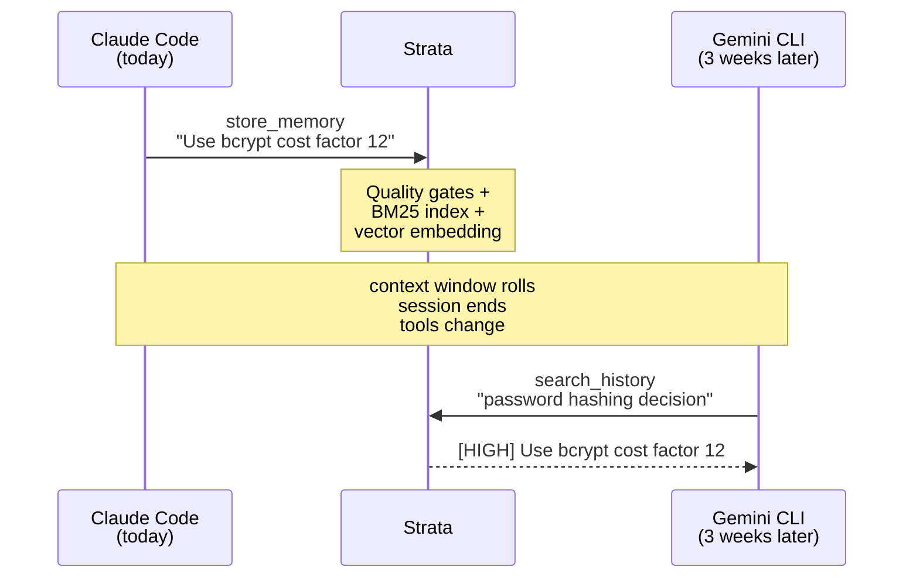

# strata-mcp

[](https://www.npmjs.com/package/strata-mcp)
[](LICENSE)
[](https://nodejs.org)
[](https://modelcontextprotocol.io)


> **An MCP memory server that gives AI coding assistants persistent, quality-gated memory across sessions and tools.**

Agents forget. Context windows roll over and the bug you fixed, the decision you made, and the pattern you found are gone. Strata captures these as structured knowledge while you work and gives them back to the next session — over the [Model Context Protocol](https://modelcontextprotocol.io), so a decision you store in Claude Code is recallable from Cursor, Cline, Codex, or Gemini CLI three weeks later.

**Retrieval that survives measurement.** On the full 500-question [LongMemEval-S](https://arxiv.org/abs/2410.10813) benchmark, Strata's deterministic BM25/FTS5 retrieval puts the correct evidence in the top 20 for **94.9% of questions** (MRR 0.907, ~16 ms p95) — keyword search alone, no LLM, no API key, fully local. That's the number to trust. Wrapped in a GPT-4o answer+judge agent loop with a 40K-token budget and Gemini extraction, the same pipeline scores 81.1% end-to-end QA accuracy — a *stack* result, not a retrieval result. Both are documented, with conditions, in [Benchmarks](docs/benchmarks.md).


```mermaid
sequenceDiagram
    participant A as Claude Code<br/>(today)
    participant S as Strata
    participant B as Gemini CLI<br/>(3 weeks later)

    A->>S: store_memory<br/>"Use bcrypt cost factor 12"
    Note over S: Quality gates +<br/>BM25 index +<br/>vector embedding
    Note over A,B: context window rolls<br/>session ends<br/>tools change
    B->>S: search_history<br/>"password hashing decision"
    S-->>B: [HIGH] Use bcrypt cost factor 12
```

Runs locally on SQLite, on Cloudflare Workers + D1, or on Google Cloud Run. No cloud required, no memory caps — everything stays on your machine unless you opt in.

---

## Why Strata

- **Quality-gated writes.** Every entry passes a deterministic [evaluator pipeline](docs/evaluator-pipeline.md) — actionability, specificity, relevance — before storage. The result stays clean and auditable, not a growing pile of everything.
- **Hybrid retrieval.** BM25 full-text (FTS5 + Porter stemming) merged with vector cosine similarity via Reciprocal Rank Fusion, plus recency, project-match, and importance signals. All parameters were tuned against frozen eval suites. See [Architecture](docs/ARCHITECTURE.md).
- **Owns its storage.** Most memory layers wrap a separate vector DB. Strata owns storage end-to-end (SQLite / D1 / Postgres), which is what lets it ship features that touch the layout — like TurboQuant 4-bit embedding quantization on the SQLite and D1 write paths.
- **Local-first.** Works fully offline with FTS5. Add a free [Gemini API key](https://aistudio.google.com/apikey) for hybrid vector search and LLM extraction; remove it and Strata makes zero outbound calls.

### Strata vs. other memory layers

|                              | **Strata**                          | Mem0            | LangMem      | Raw vector DB |
|------------------------------|-------------------------------------|-----------------|--------------|---------------|
| **Integration**              | MCP server (any MCP client)         | SDK (Python/JS) | LangChain    | DIY           |
| **Conversation ingestion**   | Auto-parses Claude/Codex/Aider/Cline/Gemini | Explicit `add()` | Explicit | DIY       |
| **Quality control on writes**| Evaluator pipeline (3 gates)        | Stores all      | Stores all   | None          |
| **Search**                   | BM25 + vector + RRF + recency       | Vector          | Vector       | Vector        |
| **Local-only mode**          | ✓ (offline, no key)                 | Hosted-default  | Configurable | ✓             |
| **License**                  | Apache 2.0                          | Apache 2.0      | MIT          | Varies        |

Mem0 is the right tool when you want memory inside a single application's SDK. Strata is the right tool when you want a memory layer **every MCP-compatible agent on your machine shares** — and can also deploy as multi-tenant infrastructure.

---

## What works today vs. roadmap

Strata is Beta. This is the honest line between what ships and what's designed but not done — if it's under **Today**, it runs now.

| Area | Today | Roadmap |
|------|-------|---------|
| **Local memory** | SQLite MCP server, 15 tools, hybrid BM25/FTS5 (vectors optional, `GEMINI_API_KEY`-gated) | — |
| **Edge deploy** | Cloudflare Workers + D1, published & production-ready | Parity eval vs. local SQLite |
| **Cloud deploy** | AWS and GCP **deployment templates** — reference-grade, self-host-ready | Multi-tenant hardening under load; "production-proven" status |
| **Quantization** | TurboQuant 4-bit on SQLite & D1 (write path) | Postgres quant (read-side + migration exist; write path stores float32) |
| **Python SDK** | Published to PyPI, **alpha (0.1.0)** | Stable API, full framework coverage |
| **npm package** | `strata-mcp` v2.3.0 published; release Worker deployed | — |
| **Game engines** | REST transport (Unity/Godot/Unreal via HTTP) | First-party Unity package ([#2](https://github.com/kytheros/strata/issues/2)) |
| **Teams / RBAC** | — | Designed, not wired |

---

## Quick Start (< 5 minutes)

```bash
npm install -g strata-mcp
strata init            # auto-detects installed CLIs; wires MCP server, hooks, skills, project context
```

Restart your CLI — the index builds on first use. Then try it:

```
You: "Remember that we use bcrypt with cost factor 12 for password hashing"
  -> store_memory({ memory: "...", type: "decision", tags: ["security","bcrypt"] })

You: "What did we decide about password hashing?"
  -> search_history({ query: "password hashing decision" })
  -> [HIGH] "Use bcrypt with cost factor 12 for password hashing"
```

Verify with `strata status`:

```
Strata v2.3.0
Database: ~/.strata/strata.db
Sessions: 142
Documents: 3847 chunks
Projects: 12
Parsers: Claude Code (detected), Codex CLI (not found), Gemini CLI (detected), ...
```

`strata init` configures Claude Code and Gemini CLI directly. **Cursor, Cline, Continue, Claude Desktop, and HTTP transport:** see [MCP Client Integration](docs/integration/mcp-client.md). Codex CLI and Aider need no wiring — Strata auto-indexes their history.

---

## How it works

```
Conversation files  →  Parsers  →  SQLite + FTS5 index
                                          │
                                 Knowledge Pipeline
                                 (evaluate → score → dedup → store)
                                          │
                           Decisions / Solutions / Fixes / Patterns
                                          │
                                    15 MCP Tools  →  Your AI Assistant
```

Every extracted entry passes three quality gates before storage:

1. **Actionability** — contains a usable pattern (use, avoid, when…then, rate limits, error fixes)
2. **Specificity** — 2+ concrete details (numbers, versions, URLs, error codes, API refs)
3. **Relevance** — an operational/technical topic

Entries that fail any gate are rejected. Full spec with accepted/rejected examples in [Evaluator Pipeline](docs/evaluator-pipeline.md).

When you run `strata init`, Strata also registers lifecycle **hooks** (error recovery, prompt context, compaction survival, knowledge extraction on session end). They're silent when they have nothing to add — zero latency on the happy path. See [Hooks and Skills](docs/HOOKS-AND-SKILLS.md).

### The 15 tools

Search (`search_history`, `find_solutions`, `semantic_search`, `search_events`), project intelligence (`list_projects`, `get_project_context`, `get_user_profile`, `find_patterns`, `get_session_summary`), memory management (`store_memory`, `delete_memory`, `ingest_document`, `store_document`), and reasoning (`reason_over_query`, `get_search_procedure`). Full reference: [docs/TOOLS.md](docs/TOOLS.md).

---

## Deploy anywhere

Strata's storage layer is pluggable via the `StorageContext` interface — the same MCP tools, full-text search, and semantic search on every backend.

| Backend | Use case | Maturity | Command |
|---------|----------|----------|---------|
| **SQLite** (default) | Local CLI, single user | Proven | `npm install -g strata-mcp` |
| **D1** | Cloudflare Workers, multi-tenant | Proven | `strata deploy cloudflare` |
| **SQLite + Litestream** | GCP Cloud Run, single user | Template | `strata deploy gcp` |
| **Postgres** | GCP Cloud Run + Cloud SQL, multi-tenant | Template | `strata deploy gcp --multi-tenant` |
| **AWS** | Fargate + Aurora + Cognito | Template | see [DEPLOYMENT.md](docs/DEPLOYMENT.md#aws) |

SQLite and D1 are the proven paths. The GCP/Postgres and AWS backends ship as **deployment templates** — reference architectures that are self-host-ready but not yet validated under multi-tenant production load. Full setup, cost tables, and the Cloud Run / AWS walkthroughs are in [Deployment](docs/DEPLOYMENT.md).

> **⚠ Multi-tenant auth — read before exposing a deployment to untrusted clients.**
> Strata identifies the caller via the `X-Strata-User` header and routes to that user's isolated database. The header alone is **trust-the-header** — Strata cannot prove the caller owns the UUID they claim. For any deployment untrusted clients can reach, you **must** front Strata with an auth proxy and require it to vouch for every request:
> ```bash
> STRATA_REQUIRE_AUTH_PROXY=1
> STRATA_AUTH_PROXY_TOKEN=$(openssl rand -hex 32)   # ≥32 chars
> ```
> The proxy authenticates the caller, maps them to a Strata user UUID, and sends `X-Strata-Verified`; Strata constant-time-compares it against the token. Without `STRATA_REQUIRE_AUTH_PROXY=1`, the backend assumes a private network boundary — fine for localhost and single-user self-hosting, **not** safe to expose publicly. Full flow (proxy diagram, REST/game-engine token model) in [Deployment](docs/DEPLOYMENT.md).

**Backup:** Strata's single SQLite file backs up to any S3-compatible bucket (S3, R2, B2, MinIO) with `strata backup push|pull|status`. See [Deployment](docs/DEPLOYMENT.md).

---

## Also supports

- **Agents you build** — deploy Strata as memory infrastructure via HTTP or multi-tenant transport; ingest from any source and let your agents learn from their own history.
- **Game engines** — a REST transport for per-NPC memory in Unity, Godot, or Unreal: two-tier auth, a dialogue-shaped `/recall` endpoint, world/agent scoping. See [Game Engine REST API](https://strata.kytheros.dev/docs/game-engine-api).
- **Local inference** — route extraction, conflict resolution, and summarization through Gemma 4 on Ollama for zero per-call cost and no data leaving the machine; accumulate training pairs to distill a private model. See [Local Inference](docs/local-inference.md).
- **Python SDK** — `pip install strata-memory` (alpha), with LangChain / CrewAI / LlamaIndex adapters. Reference and Mem0 migration guide at [strata-py](https://github.com/kytheros/strata-py).

---

## Privacy & network access

Strata runs **fully local by default** — the database, FTS5 index, and BM25 engine never leave your machine. Outbound calls happen only when you opt into an integration:

| Integration | Endpoint | Triggered by |
|---|---|---|
| Gemini embeddings + extraction | `generativelanguage.googleapis.com` | `GEMINI_API_KEY` set |
| OpenAI reasoning | `api.openai.com` | `OPENAI_API_KEY` + `reason_over_query` |
| Anthropic reasoning | `api.anthropic.com` | `ANTHROPIC_API_KEY` + `reason_over_query` |
| Cohere reranking | `api.cohere.com` | `COHERE_API_KEY` + reranker enabled |
| S3-compatible bucket | `<your-bucket>` | `strata backup push/pull` |

With no keys set, Strata makes zero outbound calls — it runs air-gapped. All HTTP uses native `fetch` (no third-party clients) per the [supply-chain policy](CLAUDE.md).

---

## Reference

| Document | What's in it |
|----------|--------------|
| [Configuration & CLI](docs/CONFIGURATION.md) | Every environment variable, config constant, and CLI command |
| [Architecture](docs/ARCHITECTURE.md) | Storage model, retrieval pipeline, ranking signals |
| [Tools](docs/TOOLS.md) | The 15 MCP tools in detail |
| [Benchmarks](docs/benchmarks.md) | LongMemEval retrieval + QA methodology and results |
| [Evaluator Pipeline](docs/evaluator-pipeline.md) | Quality gates, accepted/rejected examples |
| [Deployment](docs/DEPLOYMENT.md) | stdio, HTTP, Docker, Cloudflare, Cloud Run, AWS, backup |
| [MCP Client Integration](docs/integration/mcp-client.md) | Per-client setup, stdio + HTTP transport |
| [Hooks and Skills](docs/HOOKS-AND-SKILLS.md) | Lifecycle hooks and skill definitions |
| [Local Inference](docs/local-inference.md) | Gemma 4 / Ollama extraction and distillation |
| [Provenance & Audit](docs/provenance.md) | Tracing entries to their origin |

Requirements: **Node.js ≥ 20**. No other system dependencies (SQLite is bundled via better-sqlite3).

---

## Project

Strata is built and maintained by **[Kytheros LLC](https://kytheros.dev)** and dogfooded across its own agent workflows. This edition is **Apache 2.0 and free forever** — the feature set documented here is committed, not bait-and-switch. It grew out of a memory system built for an agent harness: even with good sub-agents, skills, and hooks, agents kept forgetting decisions already made and bugs already fixed. Strata is the fix, generalized.

- **Questions & ideas** — [GitHub Discussions](https://github.com/kytheros/strata/discussions)
- **Bugs & features** — [GitHub Issues](https://github.com/kytheros/strata/issues) ([`good first issue`](https://github.com/kytheros/strata/labels/good%20first%20issue) are scoped and reviewed quickly)
- **Security disclosures** — [SECURITY.md](SECURITY.md) (please don't file public issues)
- **Support development** — [polar.sh/kytheros](https://polar.sh/kytheros)

**Contributing:** PRs welcome — see [CONTRIBUTING.md](CONTRIBUTING.md). Sign off commits with `git commit -s` ([DCO](https://developercertificate.org/); no CLA). This project follows the [Contributor Covenant](CODE_OF_CONDUCT.md) (reports to conduct@kytheros.dev).

## License

Apache 2.0 — see [LICENSE](LICENSE). "Strata" and "Kytheros" are trademarks of Kytheros LLC; the license grants no trademark rights, so please rename forks. Built on [MCP](https://modelcontextprotocol.io), [better-sqlite3](https://github.com/WiseLibs/better-sqlite3), [Litestream](https://litestream.io), [Ollama](https://ollama.com) + [Gemma](https://ai.google.dev/gemma), [Cloudflare D1](https://developers.cloudflare.com/d1/), and the [Gemini API](https://ai.google.dev/).
